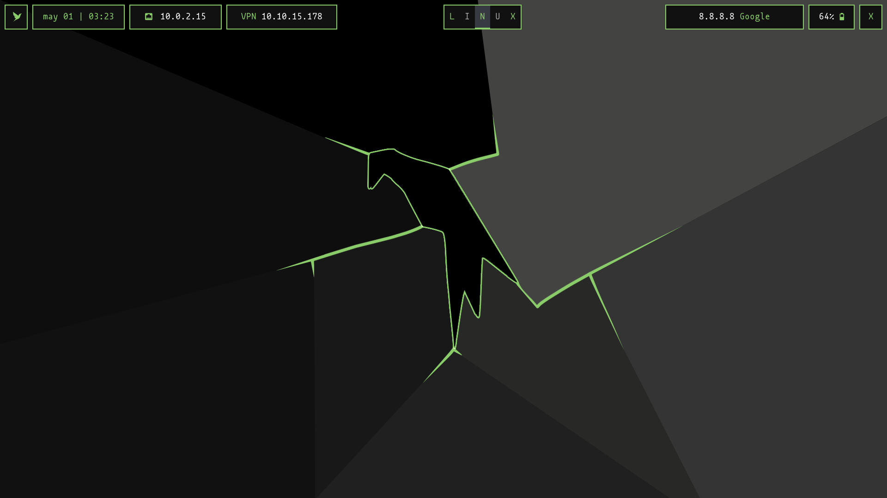

# Dotfiles para Kali Linux

Me basé en el tema Parrot del repo de [ZLCube/AutoBspwm](https://github.com/ZLCube/AutoBspwm).

Esta configuración es de mi otro repo [b4zh/dotfiles-archlinux](https://github.com/b4zh/dotfiles-archlinux), pero **adaptado a Kali Linux**.

Por lo que este README es prácticamente un **README reciclado** :)

## Entorno



## Herramientas

Las principales herramientas que conforman el entorno son:

- xorg
- bspwm
- sxhkd
- polybar
- kitty
- feh
- gvim
- firefox

## Set Target - cet
El script que permite **establecer la ip y el nombre del objetivo** se llama **cet**.

```bash
cet [ip_objetivo] [nombre_objetivo]
```

Para borrar los datos del objetivo, basta con agregar la opción `-c`.

```bash
cet -c
```
